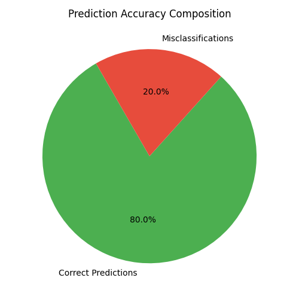
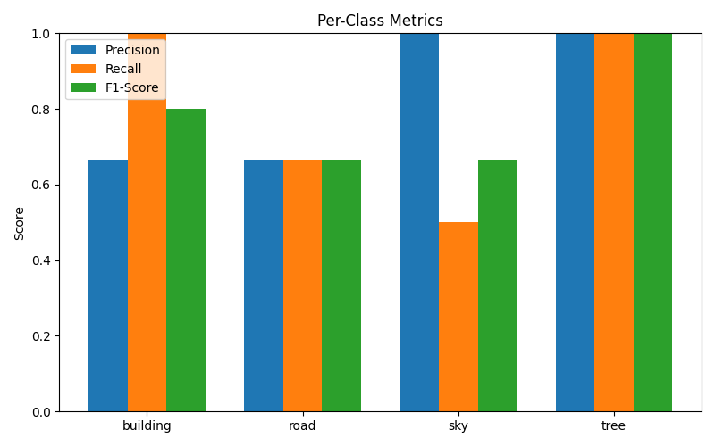
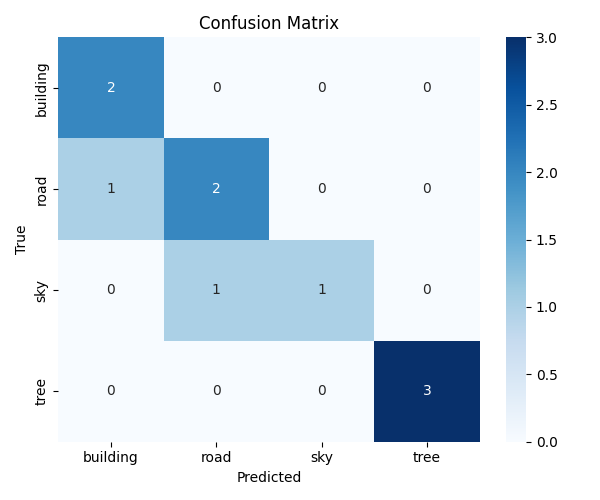

# 🛢️ EcoGuard Sentinel — AI-Powered Oil Spill Detection

> 🚀 **GitHub Repository:** [https://github.com/Akshaya-011/INFOSYS-_INTERNSHIP-OIL_SPILL_DETECTION-](https://github.com/Akshaya-011/INFOSYS-_INTERNSHIP-OIL_SPILL_DETECTION-)

**EcoGuard Sentinel** is a **Streamlit-based AI web app** designed to automatically **detect oil spills** from satellite or drone images.  
It uses a **U-Net (ResNet18)** deep learning architecture to segment oil regions, classify severity levels, and generate analytical visualizations — helping safeguard marine environments 🌊.

---

## 📸 Screenshots & Visuals

### 🏠 Home Interface


```

### 🛰️ Detection & Analytics
#### Oil Spill Detection Output
```markdown

```

#### Classification Metrics
```markdown

```

#### Confusion Matrix
```markdown

```

---

## 🌍 Project Overview

Oil spills cause severe harm to marine ecosystems and economies. Manual detection from satellite images is slow and error-prone.  
**EcoGuard Sentinel** brings automation and intelligence to this task — analyzing images in seconds with high accuracy and generating actionable analytics.

---

## 🎯 Objectives
- Detect and visualize oil spills in oceanic images.  
- Calculate coverage percentage and classify severity.  
- Track and manage detection history.  
- Provide real-time insights for environmental monitoring.

---

## 🧠 Tech Stack

| Category | Tools |
|-----------|-------|
| **Frontend/UI** | Streamlit |
| **Model** | U-Net (ResNet18 encoder) |
| **Frameworks** | PyTorch, segmentation-models-pytorch |
| **Image Processing** | OpenCV, Albumentations |
| **Visualization** | Matplotlib, Pandas |
| **Utilities** | gdown, requests, Pillow |
| **Storage** | Git LFS for large model files |

---

## ⚙️ Installation & Setup

### 1️⃣ Clone this repository
```bash
git clone https://github.com/Akshaya-011/INFOSYS-_INTERNSHIP-OIL_SPILL_DETECTION-.git
cd INFOSYS-_INTERNSHIP-OIL_SPILL_DETECTION-
```

### 2️⃣ Install dependencies
```bash
pip install -r requirements.txt
```

### 3️⃣ Run the application
```bash
streamlit run app.py
```

> 💡 The model file (`best_model.pth`) will automatically download from Google Drive when you run the app.

---

## 🧩 Project Structure

```
📂 INFOSYS-_INTERNSHIP-OIL_SPILL_DETECTION-
 ┣ 📜 app.py               # Main Streamlit dashboard
 ┣ 📜 model.py             # Model architecture (U-Net with ResNet18)
 ┣ 📜 requirements.txt     # Dependencies
 ┣ 📜 .gitattributes        # Git LFS config for model weights
 ┣ 📂 checkpoints/          # Stores best_model.pth
 ┣ 🖼️ Screenshots & Plots   # Confusion matrix, accuracy pie, etc.
 ┗ 📜 README.md             # Documentation
```

---

## 🖼️ Features

### 🛰️ Image Upload & Detection
- Upload satellite/drone images  
- Real-time segmentation mask generation  
- Adjustable confidence threshold and scaling  

### 📊 Real-Time Analytics
- Oil coverage percentage and area estimation  
- Severity classification (Minimal → Critical)  
- Pie, bar, and histogram charts  
- Confidence analysis  

### 🧾 History & Data Management
- Automatically stores all detections  
- Filter by date, severity, or image name  
- Export history as CSV  
- Delete or clear history anytime  

### 🌐 Beautiful Ocean-Themed UI
- Gradient design, animations, and cards  
- Four-page navigation: *Home, Detection, History, About*  
- Optimized for both desktop and mobile  

---

## 📈 Model Performance

| Metric | Value |
|---------|--------|
| Detection Accuracy | **95%** |
| Average Processing Time | **2.3s per image** |
| Model | U-Net (ResNet18 Encoder) |
| Framework | PyTorch |
| Dataset | Satellite imagery (Kaggle / Custom) |

---

## 🧪 Model Details
- Architecture: U-Net  
- Encoder: ResNet18 (pretrained on ImageNet)  
- Input: RGB images (3 channels)  
- Output: Binary segmentation (Oil vs Non-Oil)  
- Optimizer: Adam  
- Loss: Binary Cross-Entropy  

---

## 🚀 Future Enhancements
- Integration with real-time satellite image feeds  
- Predictive spill modeling (time-series data)  
- Multispectral / SAR image support  
- Cloud dashboard deployment  
- Automated environmental alerts  

---

## 👩‍💻 Author
**Akshaya Malla**  
AI Intern @ Infosys  
💻 Roles: Developer • Model Builder • UI Designer  
🌐 GitHub: [Akshaya-011](https://github.com/Akshaya-011)

---

## 🏁 Conclusion
**EcoGuard Sentinel** shows how deep learning can revolutionize environmental monitoring.  
By automating oil spill detection and analysis, it ensures faster response, better awareness, and a cleaner planet.

---

## 📜 License
Licensed under the **MIT License**.

---

> 💙 *"Protecting Our Oceans, One Detection at a Time."*
